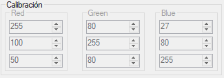

This project works with C# and  Aforge.

Aforge.net is used to detect shapes and colors with these 2 robotic arms can move to pre-selected positions 2 types of Items or objects.

The objects can be Circular, or rectangular, and the system can detect if these objects are red, green, or blue.

The positions are pre-allocated in the [arduino](/Code.ino) file.

The design and SolidWorks files for the first robotic arm you can find in my [GrabCad Models](https://grabcad.com/library/lasercut-robotic-arm-1)

The files for the second arm you can find [here too](https://grabcad.com/library/mearm-3d-1).

The biggest Robotic Arm catches the rectangular objects and stacks them in pre-allocated positions.

The small arm catches the cylindrical objects.

Sorry for the low-quality images, this project is a little bit old and outdated.

### Camera Selection:

### Color Detection:

You can select the threshold color in the right-up group box controls, this implementation uses the [Euclidean Color Filtering](http://www.aforgenet.com/framework/features/color_filtering.html):

## Note:

You can use this code for reference to your projects with C# and Arduino, this code is outdated.

### TODO:

Clean all the code, and implement autonomous triggering to catch any detected object.
The current implementation is triggered when a button is pressed.